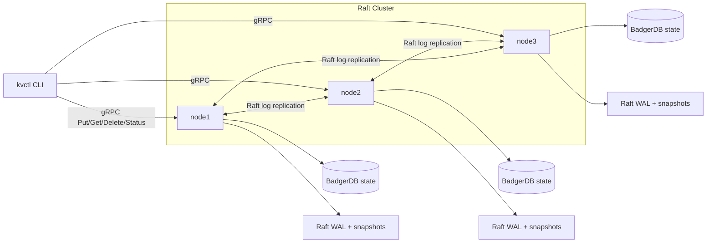

# Distributed Key-Value Store

A demo-friendly 3-node distributed key-value database in Go. It uses gRPC/protobuf for the API, HashiCorp Raft for consensus, BadgerDB for embedded storage, Bolt-backed Raft WAL files, Raft snapshots, Docker Compose, a polished `kvctl` CLI, and scripts that prove failover and recovery.

This is intentionally small enough to read, but complete enough to demo.

## Quick Demo

```bash
make demo
```

The demo script:

- starts the 3-node Docker cluster
- waits for leader election
- writes and reads sample keys
- kills the current leader
- waits for failover
- writes after failover
- restarts the killed node
- verifies previously committed data is still available

## Architecture



## Components

- `cmd/node`: starts one database node.
- `cmd/client`: builds the `kvctl` CLI.
- `internal/server`: gRPC API handlers.
- `internal/raftstore`: Raft setup, FSM commands, commits, redirects, snapshots.
- `internal/storage`: BadgerDB Put/Get/Delete, snapshot and restore helpers.
- `proto/kv.proto`: gRPC service contract.
- `scripts/demo.sh`: end-to-end failover and recovery demo.

RocksDB is not used because it adds native library setup to the Docker path. This project uses BadgerDB, a pure-Go embedded KV engine, so `docker compose up --build` stays simple and reproducible.

## CLI

Build the binaries:

```bash
make build
```

Run against the Docker cluster from the host:

```bash
bin/kvctl put foo bar
bin/kvctl get foo
bin/kvctl delete foo
bin/kvctl status
bin/kvctl leader
bin/kvctl load-test --writes 1000 --reads 1000
```

Without building first:

```bash
go run ./cmd/client -- put foo bar
go run ./cmd/client -- get foo
go run ./cmd/client -- status
go run ./cmd/client -- leader
go run ./cmd/client -- load-test --writes 1000 --reads 1000
```

Inside Docker:

```bash
docker compose exec node1 /kvctl --addr node1:50051 --peers node1=node1:50051,node2=node2:50051,node3=node3:50051 status
```

## Status Output

Example:

```text
NODE    ADDRESS          STATE      LEADER           COMMIT   APPLIED
node1   localhost:5001   leader     localhost:5001   42       42
node2   localhost:5002   follower   localhost:5001   42       42
node3   localhost:5003   follower   localhost:5001   42       42
```

The table shows node ID, client address, Raft state, current leader, commit index, and last applied FSM index.

## How Raft Is Used

All writes go through the Raft leader. A `put` or `delete` request becomes a JSON-encoded Raft log command. Once a quorum commits the entry, the FSM applies it to BadgerDB.

Followers do not accept writes. They return the leader address, and `kvctl` follows the redirect automatically.

Reads are leader-only to keep the consistency model easy to explain.

## WAL, Snapshots, Recovery

Each node persists Raft state in its Docker volume:

```text
/data/<node>/raft/logs.bolt
/data/<node>/raft/stable.bolt
/data/<node>/snapshots
/data/<node>/badger
```

The Bolt files are the persistent Raft WAL/stable stores. Snapshots contain a serialized copy of the materialized KV state. On restart, Raft restores the latest snapshot and replays committed log entries after it.

Structured logs include events like:

```text
level=info event="recovery_start" node="node1" data_dir="/data/node1"
level=info event="raft_apply_start" node="node1" op="put" key="foo"
level=info event="fsm_apply" op="put" key="foo" bytes="3" index="12"
level=info event="raft_commit" node="node1" op="put" key="foo" commit_index="12" applied_index="12"
level=info event="snapshot_create" keys="128" bytes="4096"
level=info event="snapshot_restore" keys="128" bytes="4096"
```

## Make Commands

```bash
make proto
make build
make up
make down
make demo
make test
make load-test
```

## Manual Failover Demo

Start the cluster:

```bash
make up
```

In another terminal:

```bash
go run ./cmd/client -- status
go run ./cmd/client -- put before failover
go run ./cmd/client -- get before
go run ./cmd/client -- leader
```

Stop whichever service maps to the leader address:

```bash
docker compose stop node1
```

Wait a few seconds:

```bash
go run ./cmd/client -- status
go run ./cmd/client -- put after-failover still-works
go run ./cmd/client -- get after-failover
```

Restart the killed node:

```bash
docker compose start node1
sleep 8
go run ./cmd/client -- status
go run ./cmd/client -- get before
go run ./cmd/client -- get after-failover
```

Reset all local data:

```bash
docker compose down -v
```

## Load Test

```bash
make load-test
```

Example output:

```text
leader=localhost:5001 writes=1000 reads=1000 concurrency=16 elapsed=1.6s ops_sec=1250.0
```

Actual throughput depends on Docker, CPU, disk, and whether the leader is running locally. The target is to demonstrate roughly 1,000+ local operations/sec when the machine can support it.

## Tests

```bash
make test
```

Coverage includes:

- Badger storage Put/Get/Delete
- persistence across Badger WAL restart
- snapshot restore replacing stale state
- follower write redirect using a real 3-node in-process Raft cluster

## Known Limitations

- No TLS or authentication.
- No dynamic membership changes.
- Reads are leader-only.
- Follower writes redirect instead of proxying.
- Snapshot format is a simple JSON map.
- No compaction tuning, batching API, or production-grade observability backend.
